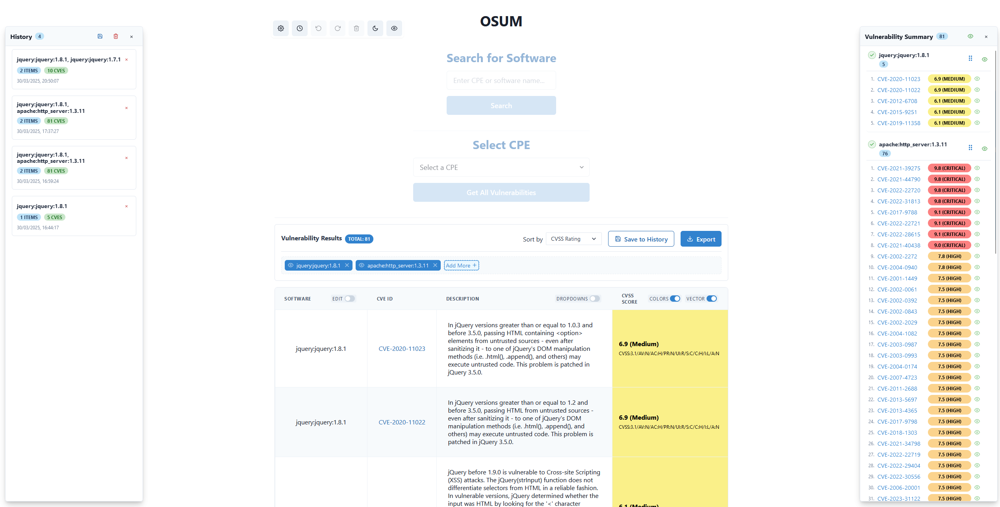

# OSUM - Outdated Software • Updates Missing

OSUM is a tool for analyzing and tracking Common Vulnerabilities and Exposures (CVEs) and Common Platform Enumeration (CPE) data. It provides an intuitive interface to search, analyze, and export vulnerability information.

## Features

- **Vulnerability Search**: Search for software vulnerabilities using CPE or CVE identifiers
- **Advanced Filtering**: Filter vulnerabilities by CVSS score, publication date, and more
- **Customizable Display**: Sort and organize vulnerability data based on your preferences
- **Export Options**: Export results in various formats (PDF, PNG, Excel, Word table)
- **History Management**: Save and load previous search results
- **Responsive Interface**: Built with Chakra UI for a modern and responsive experience
- **CVSS Visualization**: Color-coded scores for easy severity identification

## Screenshot



## Installation

### Prerequisites

- Node.js (v14 or higher)
- Python (v3.8 or higher)
- npm

### Setup

1. Clone the repository:
   ```
   git clone https://github.com/vycioha/OSUM.git
   cd osum
   ```

2. Install frontend dependencies:
   ```
   \osum> cd frontend
   \osum\frontend> npm install --legacy-peer-deps
   ```

3. Install backend dependencies:
   ```
   \osum> cd backend
   pip install flask flask-cors requests
   ```

## Running the Application

The easiest way to run both the frontend and backend together is using the provided server script:

```
\osum> node server.js
```

Alternatively, you can run them separately:

### Backend (Python Flask API)

```
cd backend
python app.py
```

### Frontend (React)

```
cd frontend
npm start
```

The application will be available at http://localhost:3000 by default, and the backend API will be accessible at http://localhost:5000.

## Usage

1. **Search for Vulnerabilities**: Enter CPE or CVE identifiers to search for specific vulnerabilities
2. **View Results**: Examine the table of vulnerabilities with their descriptions and CVSS scores
3. **Customize View**: Sort by severity or date, filter by CVSS version, and customize the display
4. **Export Data**: Use the export options to save your results in various formats
5. **Save to History**: Save important searches to revisit them later

## API Key Configuration

The application uses the National Vulnerability Database (NVD) API. While it works without an API key, using one increases rate limits:

1. Request an API key from [NVD](https://nvd.nist.gov/developers/request-an-api-key)
2. Add your API key to the appropriate configuration in the application settings

## Contributing

Contributions are welcome! Please feel free to submit a Pull Request.

## License

This project is licensed under the MIT License - see the LICENSE file for details.
